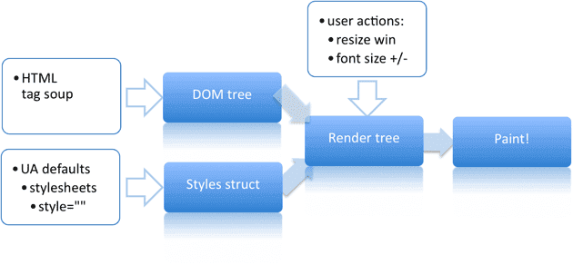

**reflow：对于DOM结构中的各个元素都有自己的盒子（模型），这些都需要浏览器根据各种样式（浏览器的、开发人员定义的等）来计算并根据计算结果将元素放到它该出现的位置，。例如某个子元素样式发生改变，直接影响到了其父元素以及往上追溯很多祖先元素（包括兄弟元素），这个时候浏览器要重新去渲染这个子元素相关联的所有元素的过程称为回流。**

**reflow 几乎是无法避免的。现在界面上流行的一些效果，比如树状目录的折叠、展开（实质上是元素的显 示与隐藏）等，都将引起浏览器的 reflow。鼠标滑过、点击……只要这些行为引起了页面上某些元素的占位面积、定位方式、边距等属性的变化，都会引起它内部、周围甚至整个页面的重新渲 染。通常我们都无法预估浏览器到底会 reflow 哪一部分的代码，它们都彼此相互影响着。**

每个页面至少需要一次回流，就是在页面第一次加载的时候。在回流的时候，浏览器会使渲染树中受到影响的部分失效，并重新构造这部分渲染树，完成回流后，浏览器会重新绘制受影响的部分到屏幕中，该过程成为重绘。

**repaint：当各种盒子的位置、大小以及其他属性，例如颜色、字体大小等都确定下来后，浏览器于是便把这些元素都按照各自的特性绘制了一遍，于是页面的内容出现了，这个过程称之为 repaint。。如果只是改变某个元素的背景色、文 字颜色、边框颜色等等不影响它周围或内部布局的属性，将只会引起浏览器 repaint（重绘）。repaint 的速度明显快于 reflow**

> 当render tree中的一些元素需要更新属性，而这些属性只是影响元素的外观，风格，而不会影响布局的，比如background-color。则就叫称为repaint重绘。 
> 注意：回流必将引起重绘，而重绘不一定会引起回流。

**浏览器渲染过程**

1. 用户输入网址（假设是个 HTML 页面，第一次访问，无缓存情况），浏览器向服务器发出HTTP请求，服务器返回 HTML 文件； （善用缓存，减少HTTP请求，减轻服务器压力）
2. 浏览器载入 HTML 代码，发现 <head> 内有一个 <link> 引用外部 CSS 文件,则浏览器立即发送CSS文件请求，获取浏览器返回的CSS文件；  （CSS文件合并，减少HTTP请求）
3. 浏览器继续载入 HTML 中 <body> 部分的代码，并且 CSS 文件已经拿到手了，可以开始渲染页面了；（CSS文件需要放置最上面，避免网页重新渲染）
4. 浏览器在代码中发现一个  标签引用了一张图片，向服务器发出请求。此时浏览器不会等到图片下载完，而是继续渲染后面的代码；    （图片文件合并，减少HTTP请求）
5. 服务器返回图片文件，由于图片占用了一定面积，影响了后面段落的排布，因此浏览器需要回过头来重新渲染这部分代码；   （最好图片都设置尺寸，避免重新渲染）
6. 浏览器发现了一个包含一行 JavaScript 代码的 <script> 标签，会立即运行该js代码；              （script最好放置页面最下面）                   
7. js脚本执行了语句，它令浏览器隐藏掉代码中的某个 
,突然就少了一个元素，浏览器不得不重新渲染这部分代码；   （页面初始化样式不要使用js控制）   
8. 终于等到了 </html> 的到来，浏览器泪流满面……
9. 等等，还没完，用户点了一下界面中的“换肤”按钮，JavaScript 让浏览器换了一下 <link> 标签的 CSS 路径；
10. 浏览器召集了在座的各位 
<ul><li> 们，“大伙儿收拾收拾行李，咱得重新来过……”，浏览器向服务器请求了新的CSS文件，重新渲染页面。

**浏览器解析大致分为四个步骤**

1. **解析HTML以构建DOM树**：渲染引擎开始解析HTML文档，转换树中的html标签或js生成的标签到DOM节点，它被称为 – 内容树。 
2. **构建渲染树**：解析CSS（包括外部CSS文件和样式元素以及js生成的样式）成样式结构体，根据CSS选择器计算出节点的样式，创建另一个树 —- 渲染树（render tree）。 
注：在解析的过程中会去掉浏览器不能识别的样式，比如IE会去掉-moz开头的样式，而firefox会去掉_开头的样式。 
3. **布局渲染树**: 从根节点递归调用，计算每一个元素的大小、位置等，给每个节点所应该出现在屏幕上的精确坐标。 
4. **绘制渲染树**: 遍历渲染树，每个节点将使用UI后端层来绘制。

> render tree能识别样式，render tree中每个node都有自己的style，而且render tree不包含隐藏的节点(比如display:none的节点，还有head节点)，因为这些节点不会用于呈现，而且不会影响呈现的，所以就不会包含到 render tree中。注意 visibility:hidden隐藏的元素还是会包含到render tree中的，因为visibility:hidden 会影响布局(layout)，会占有空间。

**导致reflow发生**
* 改变窗囗大小
* 改变文字大小
* 添加/删除样式表
* 内容的改变，如用户在输入框中敲字
* 激活伪类，如:hover (IE里是一个兄弟结点的伪类被激活)
* 操作class属性
* 脚本操作DOM
* 计算offsetWidth和offsetHeight
* 设置style属性
reflow是不可避免的，只能将reflow对性能的影响减到最小。

* 尽可能限制reflow的影响范围。需要改变元素的样式，不要通过父级元素影响子元素。最好直接加在子元素上。
* 通过设置style属性改变结点样式的话，每设置一次都会导致一次reflow。所以最好通过设置class的方式。

* 实现元素的动画，它的position属性应当设为fixed或absolute，这样不会影响其它元素的布局。
* 权衡速度的平滑。比如实现一个动画，以1个像素为单位移动这样最平滑，但reflow就会过于频繁，CPU很快就会被完全占用。如果以3个像素为单位移动就会好很多。
* 不要用tables布局的另一个原因就是tables中某个元素一旦触发reflow就会导致table里所有的其它元素reflow。在适合用table的场合，可以设置table-layout为auto或fixed，这样可以让table一行一行的渲染，这种做法也是为了限制reflow的影响范围。
* 很多情况下都会触发reflow，如果css里有expression，每次都会重新计算一遍。
* 减少不必要的 DOM 层级（DOM depth）。改变 DOM 树中的一级会导致所有层级的改变，上至根部，下至被改变节点的子节点。这导致大量时间耗费在执行 reflow 上面。
* 避免不必要的复杂的 CSS 选择器，尤其是后代选择器（descendant selectors），因为为了匹配选择器将耗费更多的 CPU。

**减少replay, reflow**

1. 让要操作的元素进行”离线处理”，处理完后一起更新 

   使用DocumentFragment进行缓存操作,引发一次回流和重绘； 

   使用display:none技术，只引发两次回流和重绘;

2. 不要一条一条地修改 DOM 的样式。与其这样，还不如预先定义好 css 的 class，然后修改 DOM 的 className，即将多次改变样式属性的操作合并成一次操作．

   使用cloneNode(true or false) 和 replaceChild 技术，引发一次回流和重绘； 

3. 不要把 DOM 节点的属性值放在一个循环里当成循环里的变量。不然这会导致大量地读写这个结点的属性。 

4. 尽可能的修改层级比较低的 DOM节点。当然，改变层级比较底的 DOM节点有可能会造成大面积的 reflow，但是也可能影响范围很小。

5. 将需要多次重排的元素，position属性设为absolute或fixed，这样此元素就脱离了文档流，它的变化不会影响到其他元素为动画的 HTML 元素，例如动画，那么修改他们的 CSS 是会大大减小 reflow 。因为,它们不影响其他元素的布局，所它他们只会导致重新绘制，而不是一个完整回流。这样消耗会更低。 

6. 不要用tables布局的一个原因就是tables中某个元素一旦触发reflow就会导致table里所有的其它元素reflow。在适合用table的场合，可以设置table-layout为auto或fixed，这样可以让table一行一行的渲染，这种做法也是为了限制reflow的影响范围。 

7. 避免使用CSS的JavaScript表达式，如果css里有expression，每次都会重新计算一遍。

8. 避免多次读取offsetLeft等属性。无法避免则将它们缓存到变量。